# Prompt Manager

Python과 Git을 활용하여 개발한 콘솔(Console) 기반 프롬프트 관리 프로그램입니다.

---

# 프로젝트 소개

Prompt Manager는 ChatGPT, Gemini 등 생성형 AI에서 사용하는 프롬프트를 효율적으로 관리하기 위한 프로그램입니다.

사용자는 프롬프트를 등록하고, 검색하고, 카테고리별로 조회하며, 즐겨찾기를 관리할 수 있습니다.

또한 JSON 파일을 이용하여 프로그램 종료 후에도 데이터를 유지할 수 있도록 구현하였습니다.

---

# 개발 환경

- Python 3.14.7
- Git 2.55.0
- Visual Studio Code
- Windows 11

---

# 프로젝트 구조

```
A1-1
│
├── main.py
├── prompts.json
├── README.md
├── .gitignore
└── images
    ├── menu.png
    ├── add.png
    ├── list.png
    ├── detail.png
    ├── favorite.png
    ├── favorite_list.png
    ├── json.png
    ├── category.png
    ├── search.png
    ├── git-user-config.png
    ├── git-clone.png
    └── git-branch-merge.png
```

---

# 실행 방법

프로젝트 폴더에서 아래 명령을 실행합니다.

```bash
python main.py
```

---

# 프로그램 구조

기능별로 함수를 분리하여 구현하였으며, 각 함수는 하나의 역할만 수행하도록 설계하였습니다.

## 함수 구성
| 함수 | 역할 |
|------|------|
| `load_prompts()` | JSON 파일에서 프롬프트 데이터를 불러옵니다. |
| `save_prompts()` | 프롬프트 데이터를 JSON 파일에 저장합니다. |
| `show_menu()` | 메인 메뉴를 출력합니다. |
| `add_prompt()` | 새로운 프롬프트를 추가합니다. |
| `show_list()` | 전체 프롬프트 목록을 출력합니다. |
| `show_by_category()` | 카테고리별 프롬프트를 조회합니다. |
| `search_prompt()` | 제목 또는 내용으로 프롬프트를 검색합니다. |
| `show_detail()` | 선택한 프롬프트의 상세 정보를 출력합니다. |
| `toggle_favorite()` | 즐겨찾기 상태를 변경합니다. |
| `show_favorites()` | 즐겨찾기한 프롬프트만 출력합니다. |
| `main()` | 프로그램의 실행 흐름을 관리합니다. |

## 데이터 구조

프롬프트 데이터는 여러 개의 항목을 관리하기 위해 `list`를 사용하고,
각 프롬프트의 제목, 내용, 카테고리, 즐겨찾기 상태를 하나의 묶음으로 관리하기 위해 `dictionary`를 사용하였습니다.

예시:

```python
prompts = [
    {
        "title": "블로그 글 작성",
        "content": "SEO에 최적화된 블로그 글을 작성해줘.",
        "category": "텍스트 생성",
        "favorite": False
    }
]
```

각 필드는 딕셔너리의 키를 이용하여 접근합니다.

```python
prompt["title"]
prompt["content"]
prompt["category"]
prompt["favorite"]
```

여러 개의 프롬프트는 리스트에 저장되므로 반복문을 사용하여 순차적으로 조회합니다.

```python
for prompt in prompts:
    print(prompt["title"])
```

### 리스트와 딕셔너리를 선택한 이유

여러 개의 프롬프트를 순서대로 저장하고 조회하기 위해 `list`를 사용하였습니다.

`list`는 데이터의 추가, 순회, 인덱스를 이용한 접근이 간단하다는 장점이 있으며,
프롬프트 목록처럼 여러 항목을 순서대로 관리하는 데 적합합니다.

다만 데이터가 많아질 경우 특정 조건의 항목을 찾기 위해 전체 리스트를 순회해야 하므로
검색 성능이 떨어질 수 있다는 단점이 있습니다.

각 프롬프트의 제목, 내용, 카테고리, 즐겨찾기 상태는 서로 다른 속성을 가지므로
하나의 프롬프트를 표현하기 위해 `dictionary`를 사용하였습니다.

이번 프로젝트는 데이터 규모가 크지 않고 구조가 단순하므로
`list`와 `dictionary`를 함께 사용하는 방식이 가장 적합하다고 판단하였습니다.

## 입력 검증

- 제목과 내용은 빈 값을 허용하지 않습니다.
- 카테고리는 정의된 번호만 선택할 수 있습니다.
- 프롬프트 번호는 숫자 및 범위를 검사합니다.
- 검색어는 빈 문자열을 허용하지 않습니다.

## 프로그램 실행 흐름

프로그램은 메인 메뉴를 반복해서 사용할 수 있도록 `while True` 반복문을 사용하였습니다.

사용자는 원하는 기능을 여러 번 수행할 수 있으며, 메뉴 번호 `0`을 선택할 때까지 프로그램이 계속 실행됩니다.

```python
while True:
    show_menu()

    choice = input("메뉴 선택: ")

    ...

    elif choice == "0":
        print("프로그램을 종료합니다.")
        break
```

### 반복문을 사용한 이유

- 프로그램을 종료하지 않고 여러 기능을 연속해서 사용할 수 있도록 하기 위함입니다.
- 메뉴 선택 후 다시 메인 메뉴로 돌아와 다른 기능을 수행할 수 있습니다.
- 사용자가 종료를 선택할 때까지 프로그램이 계속 실행됩니다.

### 종료 조건

다음 경우 반복문이 종료됩니다.

- 메뉴에서 `0`을 입력한 경우
- `break` 문을 실행하여 반복문을 종료합니다.

### 예외 처리

잘못된 메뉴 번호를 입력한 경우 프로그램을 종료하지 않고 안내 메시지를 출력한 후 다시 메뉴를 표시합니다.

```python
else:
    print("잘못된 메뉴 번호입니다.")
```

---

## 중복 데이터 처리 정책

현재 프로그램은 프롬프트 제목의 중복 입력을 허용하도록 설계하였습니다.

동일한 제목이라도 내용이나 활용 목적이 다를 수 있으므로
제목만으로 중복 여부를 판단하지 않습니다.

따라서 새로운 프롬프트는 제목이 동일하더라도 별도의 데이터로 저장됩니다.

향후 프로그램을 확장할 경우에는 제목 중복 검사 또는 자동 번호 부여 기능을 추가할 수 있습니다.

---

# 주요 기능

## 1. 프롬프트 추가

- 제목 입력
- 내용 입력
- 카테고리 선택
- JSON 자동 저장

---

## 2. 프롬프트 목록 조회

등록된 모든 프롬프트를 출력합니다.

즐겨찾기 항목은 ⭐ 표시됩니다.

---

## 3. 카테고리별 조회

다음 카테고리를 지원합니다.

- 텍스트 생성
- 이미지 생성
- 영상 생성
- 페르소나
- 자동화
- 기타

---

## 4. 프롬프트 검색

제목 또는 내용에서 검색어를 찾아 출력합니다.

### 검색 방식

프롬프트 검색은 사용자가 입력한 검색어가 각 프롬프트의 `title` 또는 `content`에 포함되어 있는지 확인하는 방식으로 구현하였습니다.

```python
if (
    keyword.lower() in prompt["title"].lower()
    or keyword.lower() in prompt["content"].lower()
):
```

검색 시 `lower()`를 사용하여 영어 대소문자를 구분하지 않도록 처리하였습니다.

예를 들어 `AI`, `ai`, `Ai`는 동일한 검색어로 처리됩니다.

검색어가 비어 있는 경우에는 검색을 수행하지 않고 안내 메시지를 출력합니다.

```python
if not keyword:
    print("검색어를 입력해주세요.")
    return
```

---

## 5. 프롬프트 상세 보기

선택한 프롬프트의

- 제목
- 내용
- 카테고리
- 즐겨찾기 여부

를 확인할 수 있습니다.

---

## 6. 즐겨찾기 기능

즐겨찾기를 추가하거나 해제할 수 있습니다.

즐겨찾기 목록도 별도로 조회 가능합니다.

---

## 7. JSON 저장/불러오기

프로그램 종료 후에도 데이터가 유지되도록 JSON 파일을 사용하여 저장 및 불러오기 기능을 구현하였습니다.


---

# 실행 화면

## 메인 메뉴

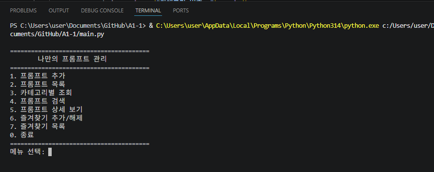

---

## 프롬프트 추가

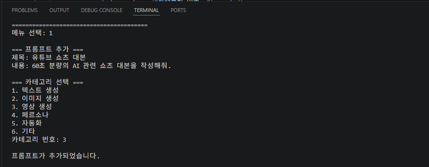

---

## 프롬프트 목록

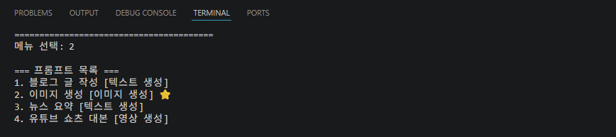

---

## 카테고리별 조회

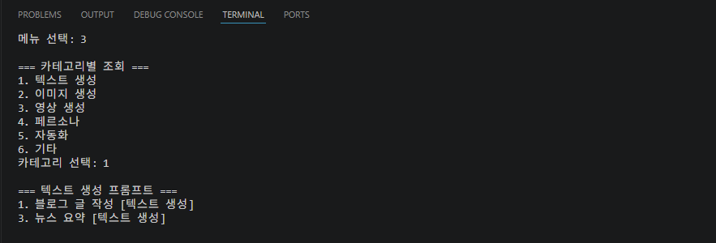

---

## 프롬프트 검색

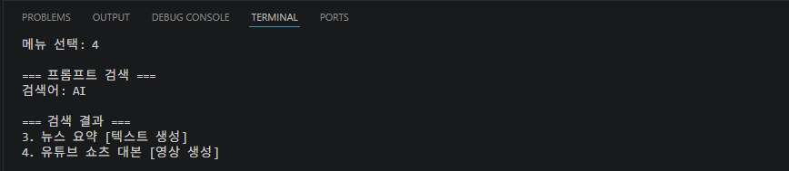

---

## 프롬프트 상세보기

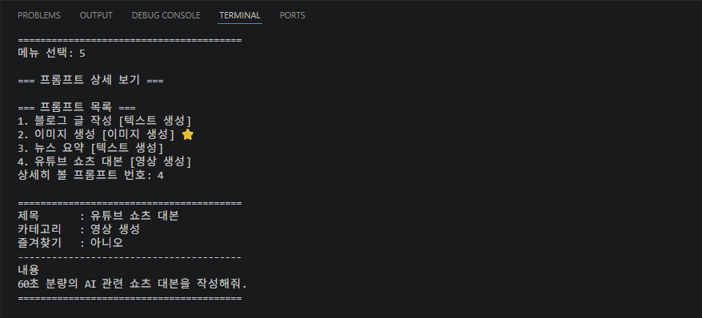

---

## 즐겨찾기

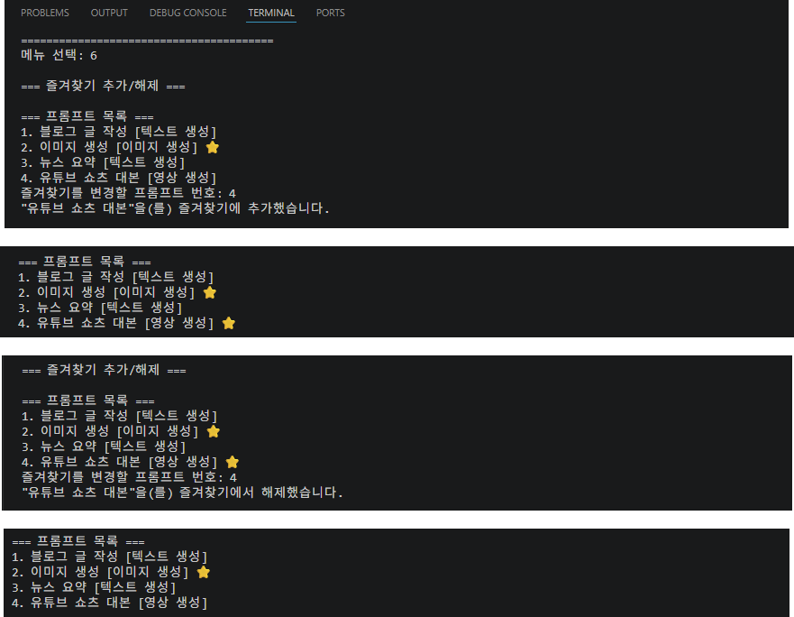

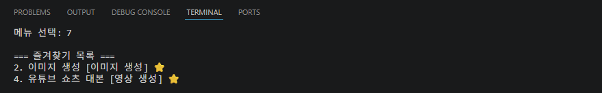

---

## JSON 저장 확인

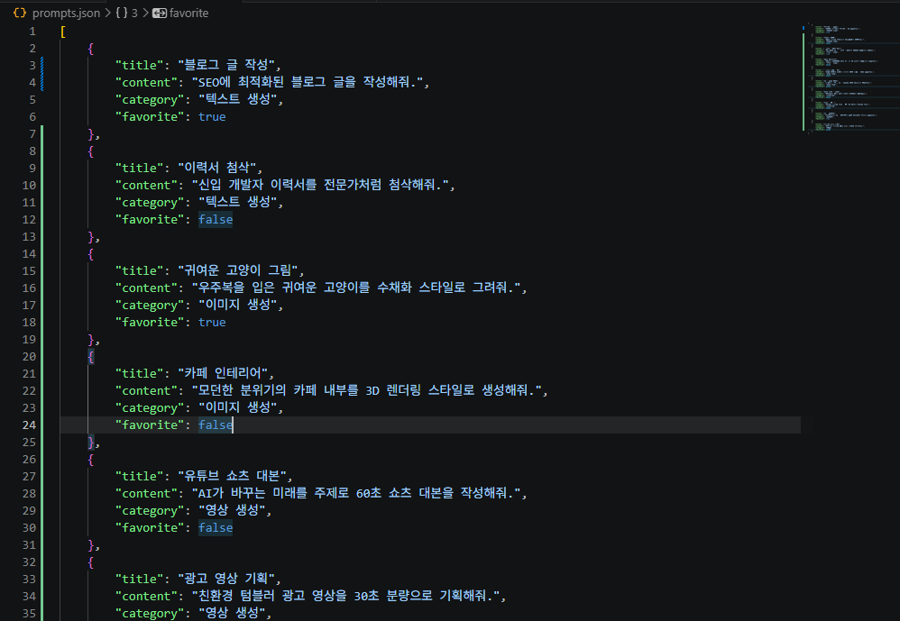

---

# Git 사용 내역

프로젝트 개발 과정에서 아래 Git 명령을 사용하였습니다.

* `git init` → Git 시작
* `git add` → 변경사항 준비
* `git commit` → 변경사항 저장
* `git checkout` → 브랜치 이동
* `git merge` → 브랜치 합치기
* `git push` → 원격 저장소에 업로드
* `git pull` → 원격 저장소에서 가져오기
* `git clone` → 원격 저장소 복사


브랜치를 생성하여 기능을 개발한 후 main 브랜치로 병합(Merge)하였습니다.
---

# Git 실습 내용

이번 프로젝트에서는 Git과 GitHub를 활용하여 버전 관리를 수행하였습니다.

---

## Git Commit 기준

프로젝트의 변경 이력을 이해하기 쉽도록 기능 단위로 커밋하였습니다.

하나의 커밋에는 가능한 한 하나의 기능 또는 하나의 수정 사항만 포함하도록 하였습니다.

예시:

```text
feat: add prompt creation feature
feat: add prompt search feature
feat: add favorite toggle feature
docs: complete README
```

커밋 메시지는 변경 목적을 쉽게 알 수 있도록 다음 기준으로 작성하였습니다.

- `feat:` 새로운 기능 추가
- `fix:` 오류 수정
- `docs:` 문서 수정
- `chore:` 프로젝트 설정 및 기타 작업
- `merge:` 브랜치 병합

예를 들어 프롬프트 검색 기능을 구현한 경우 다음과 같이 커밋하였습니다.

```bash
git add main.py
git commit -m "feat: add prompt search feature"
```


## Git 사용자 설정

Git을 사용하기 전에 사용자 이름과 이메일을 설정하였습니다.

### 사용자 정보 설정

```bash
git config --global user.name "ByeongGwang Nam"
git config --global user.email "michaelis@naver.com"
```

### 설정 확인

```bash
git config --global user.name
git config --global user.email
```

### 실행 결과

```text
ByeongGwang Nam
michaelis@naver.com
```

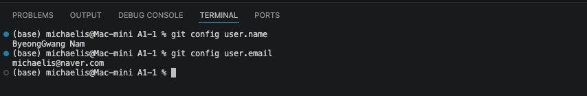

---

## Git Clone

원격 저장소를 로컬 컴퓨터로 복제하기 위해 `git clone` 명령을 사용했습니다.

```bash
git clone https://github.com/quantmichael/A1-1.git A1-1-clone
```

### 실행 결과

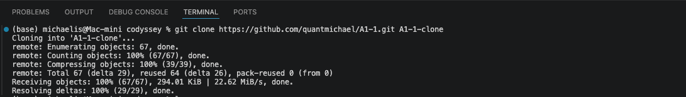

## Git 브랜치 및 병합

기능 개발을 위해 브랜치를 생성하여 작업한 후 `main` 브랜치로 병합하였습니다.

### 브랜치 운영 기준

기능별로 작업 내용을 분리하기 위해 별도의 브랜치를 생성하였습니다.

예를 들어 다음과 같이 기능 단위로 브랜치를 사용하였습니다.

- `feature/category-validation` : 카테고리 입력 검증 기능 개발
- `feature/readme` : README 문서 개선 작업

브랜치를 분리한 이유는 `main` 브랜치의 안정성을 유지하면서 기능별 작업을 독립적으로 진행하기 위해서입니다.

기능 구현과 테스트가 완료된 후 해당 브랜치를 `main` 브랜치에 병합하였습니다.

병합 전에는 다음 사항을 확인하였습니다.

- 기능이 정상적으로 동작하는지 확인
- 실행 오류가 없는지 확인
- 변경 내용을 커밋했는지 확인


### 브랜치 생성

```bash
git checkout -b feature/readme
```

### 브랜치 병합

```bash
git checkout main
git merge feature/readme
```

### 브랜치 및 병합 확인

```bash
git log --oneline --graph --all
```

### 실행 결과


## Git 병합 충돌 처리

이번 프로젝트에서는 병합 충돌이 발생하지 않았습니다.

만약 동일한 파일을 여러 브랜치에서 수정하여 충돌이 발생하는 경우에는 다음 절차에 따라 해결합니다.

1. Git이 표시한 충돌 위치를 확인합니다.
2. 필요한 내용을 선택하거나 수정하여 충돌을 해결합니다.
3. 수정 내용을 저장합니다.
4. 변경 내용을 다시 Commit 합니다.
5. 정상적으로 Merge 되었는지 확인합니다.

병합 완료 후에는 프로그램이 정상적으로 실행되는지 테스트하여 최종 확인합니다.

---

# 학습 내용

이번 프로젝트를 통해 다음 내용을 학습하였습니다.

- Python 함수 분리와 프로그램 구조 설계
- List와 Dictionary를 활용한 데이터 관리
- 입력값 검증과 예외 처리
- JSON 파일 저장 및 불러오기
- Git 버전 관리
- GitHub 원격 저장소 관리
- Branch 생성 및 Merge

---

# GitHub Repository

[Prompt Manager GitHub Repository](https://github.com/quantmichael/A1-1)
