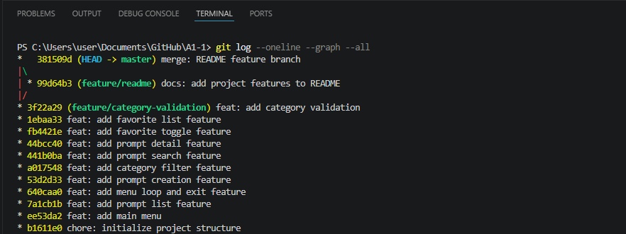

# Prompt Manager

Python과 Git을 활용하여 개발한 콘솔(Console) 기반 프롬프트 관리 프로그램입니다.

---

# 프로젝트 소개

Prompt Manager는 ChatGPT, Gemini 등 생성형 AI에서 사용하는 프롬프트를 효율적으로 관리하기 위한 프로그램입니다.

사용자는 프롬프트를 등록하고, 검색하고, 카테고리별로 조회하며, 즐겨찾기를 관리할 수 있습니다.

또한 JSON 파일을 이용하여 프로그램 종료 후에도 데이터를 유지할 수 있도록 구현하였습니다.

---

# 개발 환경

- Python 3.14.7
- Git 2.55.0
- Visual Studio Code
- Windows 11

---

# 프로젝트 구조

```
A1-1
│
├── main.py
├── prompts.json
├── README.md
├── .gitignore
└── images
    ├── menu.png
    ├── add.png
    ├── list.png
    ├── detail.png
    ├── favorite.png
    ├── json.png
    ├── gitlog.png
    └── github.png
```

---

# 실행 방법

프로젝트 폴더에서 아래 명령을 실행합니다.

```bash
python main.py
```

---

# 주요 기능

## 1. 프롬프트 추가

- 제목 입력
- 내용 입력
- 카테고리 선택
- JSON 자동 저장

---

## 2. 프롬프트 목록 조회

등록된 모든 프롬프트를 출력합니다.

즐겨찾기 항목은 ⭐ 표시됩니다.

---

## 3. 카테고리별 조회

다음 카테고리를 지원합니다.

- 텍스트 생성
- 이미지 생성
- 영상 생성
- 페르소나
- 자동화
- 기타

---

## 4. 프롬프트 검색

제목 또는 내용에서 검색어를 찾아 출력합니다.

---

## 5. 프롬프트 상세 보기

선택한 프롬프트의

- 제목
- 내용
- 카테고리
- 즐겨찾기 여부

를 확인할 수 있습니다.

---

## 6. 즐겨찾기 기능

즐겨찾기를 추가하거나 해제할 수 있습니다.

즐겨찾기 목록도 별도로 조회 가능합니다.

---

## 7. JSON 저장/불러오기

프로그램 종료 후에도 데이터가 유지되도록 JSON 파일을 사용하여 저장 및 불러오기 기능을 구현하였습니다.

---

# Git 사용 내역

프로젝트 개발 과정에서 아래 Git 명령을 사용하였습니다.

- git init
- git add
- git commit
- git checkout
- git merge
- git push
- git pull
- git clone

브랜치를 생성하여 기능을 개발한 후 main 브랜치로 병합(Merge)하였습니다.

---

# 실행 화면

## 메인 메뉴


---

## 프롬프트 추가


---

## 프롬프트 목록


---

## 프롬프트 상세보기


---

## 즐겨찾기


---

## JSON 저장 확인


---

# Git 로그



---

# 학습 내용

이번 프로젝트를 통해 다음 내용을 학습하였습니다.

- Git 버전 관리
- GitHub 원격 저장소 관리
- Branch 생성 및 Merge

---

# GitHub Repository

https://github.com/quantmichael/A1-1